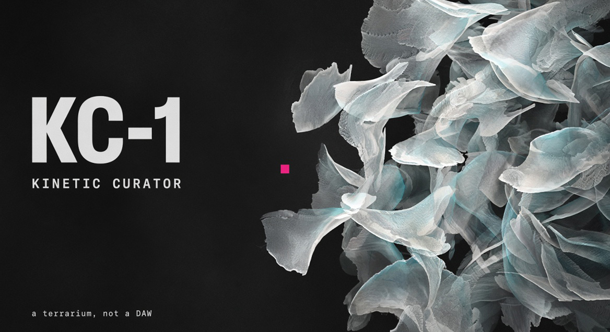

# Kinetic Curator

**KC-1** — a generative art instrument for live visual performance. React + Vite + one WebGL2 pipeline. What plays is what renders.

Live: [neuralio444.github.io/Kinetic_Curator](https://neuralio444.github.io/Kinetic_Curator/)



*A terrarium, not a DAW.* You curate plates, palettes, and voices. The seed and the wind do the rest.

**Release on `main` (2026-09-19):** shipped as **[0.9.0](CHANGELOG.md)** kernel + the unreleased GPU instrument (live loop #224). The body is not finished. See [Now](#now-on-main).

## Now on main

The picture already has mass (organic plates, ACCUM, flagship voices). The flock is still frame-coupled. That is the gap.

**Connected and live**

- One WebGL2 loop for canvas and stills (`app/src/gl/liveLoop.mjs`). SVG emitter is a dev-only parity reference.
- Kernel v1 — index-stable placements, channel RNG, sampler registry, K3–K5.
- PATCH on the track: OFF / MOD / FIELD / FEED (#382 / #373 / #370).
- Voice + preset MIX stepper (~6 color/count stops/sec) — does not rebake every frame (#381 / #379).
- Flagship voices, 4 content-track cap, H/M/L asset locker, FADE on the palette bar.
- ACCUM trails, GPU FX (9; 4 in the add menu), showrunner shed ladder.
- Behave profiles + bio-drives on one integrator. Audio ballistics module exists; not yet on the visible life path.

**Not done (do not advertise as shipped)**

- Spine **A** dt clock — [#387](https://github.com/NeuralIO444/Kinetic_Curator/issues/387). Flock speed still follows FPS.
- **B** skip-missing atlas cell. Palette slams can stall a frame.
- **C** heading spring + ballistics + life. `motionSmoothing` is unread; heading still snaps ~10°/tick.
- Quantized MIX wipe, shared clock, Studio/Perform split — specified, not built.

**Embargo:** no new features until C is felt. Plan only: [docs/EMBARGO.md](docs/EMBARGO.md). Agents: [AGENTS.md](AGENTS.md) + [docs/ENGINE_PLAN.md](docs/ENGINE_PLAN.md).

## Philosophy

Not a blank canvas. You assign palettes and instruct placement DNA. *We are not painting; we are breeding variations in a terrarium.* Ghost Station (`E` Evolve) mutates; you snapshot (`S`) and favorite (`F`).

## Reproducibility

**Full project JSON** (OUTPUT → ↓ PROJECT) is the unit: seed, palette, layout, assets, weights, quality, layers.

- Index `i` keeps scale / rotation / alpha / asset / color when count changes.
- RNG channels: `dens` / `geo` / `attr` / `asset` / `color` / `noise` / `dyn`.
- `createNoise(seed)` — no global perm table.
- Golden fixture: **`kernel.v1`**. 0.8 seeds will not match pixel-for-pixel.
- Audio, LFO life, Evolve are **live-only**. Still hashes ignore them.
- RENDER FINAL matches the live preview (UNCAPPED off). ACCUM stills export the trail buffer.

## Features

- **Live instrument** — Fibonacci, Grid, CA, Orbit, Flow, Swarm, Stratified, … same GPU as exports.
- **Stills** — GPU readback 1×–8K PNG + JSON sidecar.
- **Parity** — `npm run selfcheck`; under 10% pixel vs the SVG reference is a pass.
- **FX** — rgbSplit, displace, tear, grain, scanlines, posterize, invert, solarize, edge. No gaussian blur.
- **ACCUM** — phosphor trails, bloom / halation / stipple. FREEZE / CLEAR. Silence is a no-op.
- **Governor** — shed resolution, then quality, assets, count, motion. Always reported.
- **Tracks** — KC-1…KC-4 + FX slots; active layer drives LAYOUT / ASSETS / DAVIS.
- **Audio** — mic or file → scale, opacity, evolve-on-beat (full shove is spine C).
- **Davis** — Evolve, morph, phrase clock, LFO life.
- **Hits** — 1–9 recall, Enter advances.
- **Colour** — slot edit / locks, library, harmony + shuffle, FADE.
- **Organisms** — moth / petal bodies, flap, materials, named behave profiles.
- **Assets** — drop SVG, tags, H/M/L, DUP. Lab / species editor is deferred.
- **Studio farm** — `studio/studio.py` stills, ACCUM, batch, ffmpeg video, gated Curator CLIP.

## Stack

React 19 · Vite 8 · Zustand + `useApp` · `engine/kernel/*` · `app/src/gl/*` · CSS variables · Playwright + `selfcheck`.

## Install

```bash
git clone https://github.com/NeuralIO444/Kinetic_Curator.git
cd Kinetic_Curator/app
npm install
npm run dev
```

http://localhost:5173

| Command | Purpose |
|---------|---------|
| `npm run dev` | Vite |
| `npm run build` | Production |
| `npm run lint` | ESLint |
| `npm run selfcheck` | Golden hash + kernel / GL / governor |
| `npm run test:e2e` | Playwright |
| `npm run preflight` | lint → selfcheck → build → e2e |

```bash
python3 studio/studio.py render my.project.json -o out.png --res 7680x4320 --sidecar
python3 studio/studio.py render my.project.json -o trails.png --accum --steps 24
python3 studio/studio.py batch my.project.json -o editions/ --count 500 --start-seed 0 --res 2
python3 studio/studio.py video my.project.json -o out.mp4 --fps 30 --duration 4 --res 1920x1080
```

Needs `ffmpeg` for video and `cd app && npx playwright install chromium` for GPU farm paths.

## Deploy

Pages is already on **GitHub Actions** → [live site](https://neuralio444.github.io/Kinetic_Curator/). Vercel: `vercel.json` builds `app/` with `VITE_BASE=/`. Netlify: `cd app && npm ci && VITE_BASE=/ npm run build` → `app/dist`.

## Docs

- [Engine plan](docs/ENGINE_PLAN.md) — spine A–G, do not redo shipped MIX/MOD
- [Embargo](docs/EMBARGO.md) · [Two planes](docs/TWO_PLANES.md) · [Tempo](docs/TEMPO_AND_CHIPS.md)
- [GL contract](docs/GL_CONTRACT.md) · [ACCUM](docs/ACCUM.md) · [Showrunner](docs/SHOWRUNNER.md)
- [Organic motion](docs/ORGANIC_MOTION.md) · [Noise](docs/NOISE_AND_LAYERS.md) · [Tracks](docs/KC1_LAYERS.md)
- [Manifesto](docs/manifesto.md) · [Changelog](CHANGELOG.md) · [Buglist](docs/BUGLIST.md)

## Hotkeys

`Space` pause · `S` snap · `F` favorite · `E` Evolve · `N` new seed · `G` fullscreen · `Cmd+Z` undo · `?` overlay · `1–9` hits · `Enter` advance setlist

## License

MIT. See `LICENSE`.
