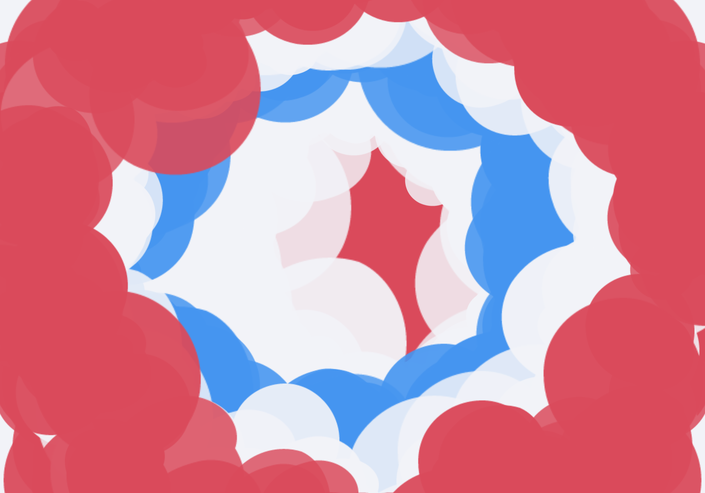

# Kinetic Curator

A generative art instrument for live visual performance, built with React, Vite, and WebGL2. Inspired by the workflow of Joshua Davis and the generative algorithms of the demoscene, Kinetic Curator is for "curated chaos"—intricate, mathematically driven compositions that react to live audio and evolve autonomously. One WebGL2 renderer drives the live canvas and the exported stills alike: what plays is what renders.



**Current release: [0.9.0](CHANGELOG.md)** — kernel v1 + colour authoring, multi-layer compositing, organisms, asset ingest, and the studio farm. Since 0.9.0 the whole instrument went fully GPU: the live WebGL loop (#224) retired the old SVG split — one renderer, no preview/final mismatch. The SVG emitter survives in-repo only as the dev-only parity reference, excluded from the shipped bundle (see [CHANGELOG unreleased](CHANGELOG.md)).

## Core Philosophy: "Curated Chaos"

Kinetic Curator is not a blank canvas; it is a synthesis engine. You curate the parameters (the layout grid, the SVG assets, the color palettes) and let the random seed drive the chaos. By combining algorithmic layout modes (Fibonacci, CA, Perlin Flow, Stratified, …) with live microphone input and dynamic seed mutation, the tool functions like a generative synthesizer.

## Reproducibility

**Full project JSON** (OUTPUT → ↓ PROJECT) is the reproducible unit: seed, palette, layout, enabled assets, weight overrides, quality, layers.

### Kernel v1 (0.9+)

- Placement identity is **index-stable**: scale / rotation / alpha / asset / color for index `i` do not reshuffle when count or density changes.
- Density skips and attributes use isolated RNG **channels** (`engine/kernel/rng.js`: `dens` / `geo` / `attr` / `asset` / `color` / `noise` / `dyn`).
- Noise displacement uses **`createNoise(seed)`** instances (no global perm table).
- Layout modes are **samplers** (`getSampler`); optional mode **`stratified`** for even coverage.
- **K3** scalar fields (CA density sampling), **K4** particle bake (deterministic swarm stills), **K5** colour assignment channel — all shipped.
- Golden CI fixture version: **`kernel.v1`**. Seeds from **0.8 and earlier will not match** pixel-for-pixel under 0.9 — re-curate favorites if needed.

### Still true

- Quality caps still clamp how many placements draw (per layer); prefer saving **project JSON** over seed alone.
- Audio, LFO life, and Evolve are **live-only** and are not part of deterministic stills.
- **RENDER FINAL** (UNCAPPED off) matches the live preview; UNCAPPED may densify then restore live caps.
- **ACCUM** stills export the **pixel trail buffer**. Offline true-resolution trails: `studio.py render --accum`.

## Features

- **Live instrument** — one WebGL2 render loop across layout modes (Fibonacci, Grid, CA, Orbit, Flow, Swarm, Stratified, …). The visible canvas renders through the same GPU pipeline as exported stills (`gl/liveLoop.mjs`), so what plays is what renders.
- **Stills through the same GPU** — exports render through the live renderer: scene → GPU textures → 4K/8K PNG via readback, PNG + JSON sidecar. The old SVG emitter survives in-repo only as the dev-only parity reference — nothing in the production import graph reaches it.
- **Pixel parity** — a headless harness diffs the GPU render against the SVG parity reference on fixed seeds, wired into `npm run selfcheck`. The bar: under 10% pixel difference is a pass — this is art, not rocket science.
- **GPU FX library** — 9 effects (rgbSplit, displace, tear, grain, scanlines, posterize, invert, solarize, edge) as GLSL passes, chained per FX layer. The add-menu curates 4 (RGB Split, Displace, Tear, Invert); the other five stay renderable. Gaussian blur is gone (#308/#310). Every effect declares a cost tier at registration, measured against real GPU cost and CI-gated.
- **ACCUM feedback** — HYPE-style trails on GPU ping-pong textures: trails decay like phosphor (light fades toward black), with bloom, halation, and stipple-diffusion optics. FREEZE holds the feedback image; CLEAR re-seeds. Audio-reactive glow, flow-advected trails, and multi-tap echoes arrive when audio is live — silence is a true no-op.
- **Showrunner governor** — the enforcer: measured cost tiers, and a fixed shed ladder — resolution scaling first, then quality, asset thinning, count clamp, motion freeze. Every shed is a render-only overlay, auto-clears on recovery, and is always reported — never silent.
- **Render quality pillars** — one kernel, one seed; finals render off-store with no live-state mutation; caps hold; substitutions are recorded in the sidecar, never hidden.
- **Multi-layer compositing** — add / reorder / show-hide layers; per-layer blend + opacity; active layer drives LAYOUT / ASSETS / DAVIS edits.
- **Audio reactivity** — mic or file drives scale, opacity, and evolve-on-beat.
- **Davis mode** — time/beat Evolve, morph transitions, phrase clocks, continuous LFO life.
- **Behave modes** — named organism steering (cruise, flock, orbit, scatter): weight profiles over one shared particle integrator. Adding a profile is a row in a table, not a new force type.
- **Hits setlist** — ordered favorites, 1–9 recall, Enter advances, morph layout A→B.
- **Weights** — per-asset H/M/L + category bulk mix before weighted pick.
- **Colour authoring** — full palette reveal, slot edit / locks, `paletteShift`, user palette library (save / switch / import-export), harmony schemes + shuffle.
- **Organisms / bodies** — moth-style hype organisms, bilateral wings, drop→petal ladders, flap-phase behaviour, material defs.
- **Asset ingest** — paste / drop SVG into overlay; sanitised user assets; duplicate → project overlay.
- **Presets** — shipped looks including KILN COLUMNS (lathe-like organic stacks on dusty matte) and VORTEX RWB (kaleidoscopic red/white/blue ribbons), plus the classic set.
- **Export**
  - SNAP / **RENDER FINAL** (matches the live canvas; UNCAPPED densifies then restores live caps)
  - **BATCH ×N** — sequential seeds → PNG + JSON sidecar (max 48 in-browser; big runs go through `studio.py batch`)
  - **ACCUM** trails (LAYOUT toggle) + CLEAR ACCUM
  - WebM record · project import/export · autosave
- **Studio (offline)** — headless render farm (`studio/`): WebGL2 GPU readback stills at any resolution (1×–8K) + PNG sidecar; true-res ACCUM trails; batch editions; video (per-frame GPU renders → ffmpeg MP4); Curator CLIP taste model (rank / more-like-this); generative asset expansion (gated); geometry blend + asset audit.
- **Perf** — quality caps, gloss LOD, enabled-only symbol sheet, stable placement keys, SoA placement fill, staged eval + dirty-flag cache (geometry skipped on pure life/modulation frames).

## Technology Stack

- **Framework:** React 19 + Vite 8
- **State:** Zustand slices + `useApp` dispatch facade + typed event bus
- **Engine:** Pure kernel (`engine/kernel/*`: rng, noise, sample, field, color, bake) + `buildPlacements` + staged eval cache
- **Render:** one WebGL2 GPU pipeline (`app/src/gl/*`): the live canvas loop, texture-atlas assets, GLSL FX, layer compositing, GPU accumulation + bloom, and GPU-readback stills. The SVG emitter survives in-repo only as the dev-only parity reference — `gl/phase6.selfcheck.mjs` proves nothing in the production import graph reaches it.
- **Styling:** CSS custom properties (dark creative-tool UI)
- **Export:** GPU readback → PNG + JSON sidecar; offline farm via `studio/` (headless Chromium + WebGL2); video via ffmpeg
- **CI:** ESLint, `npm run selfcheck` (golden placement SHA + kernel / field / color / bake / harmony / organisms / stagedEval / perf / GL parity / shader / governor checks), Playwright smoke

## Installation & Setup (local)

```bash
git clone https://github.com/NeuralIO444/Kinetic_Curator.git
cd Kinetic_Curator/app
npm install
npm run dev
```

Open **http://localhost:5173**.

### Scripts

| Command | Purpose |
|---------|---------|
| `npm run dev` | Vite dev server |
| `npm run build` | Production build |
| `npm run lint` | ESLint |
| `npm run selfcheck` | Placement determinism + golden hash + kernel / field / color / bake / organisms / staged-eval / perf checks |
| `npm run test:e2e` | Playwright smoke (needs build + browsers) |
| `npm run preflight` | lint → selfcheck → build → e2e |

### Offline studio

Stills and editions render on the GPU (headless Chromium + WebGL2) — same
pipeline the app uses for finals, at any resolution up to 8K. If Chromium is
missing the commands refuse rather than rendering a different recipe.

```bash
# one still at 8K (+ JSON sidecar)
python3 studio/studio.py render my.project.json -o out.png --res 7680x4320 --sidecar

# ACCUM trail still (not a movie)
python3 studio/studio.py render my.project.json -o trails.png --accum --steps 24

# 500 editions, one PNG + one JSON sidecar each
python3 studio/studio.py batch my.project.json -o editions/ --count 500 --start-seed 0 --res 2

# fixed-timestep frame sequence → MP4 (needs ffmpeg)
python3 studio/studio.py video my.project.json -o out.mp4 --fps 30 --duration 4 --res 1920x1080
```

Needs: `ffmpeg` on PATH for video, and `cd app && npx playwright install chromium` for the GPU render paths.

## Public deployment

### Option A — GitHub Pages

1. Repo → **Settings → Pages** → Source: **GitHub Actions**.
2. Push to `main` (or run **Deploy to GitHub Pages** under Actions).
3. Site: **https://neuralio444.github.io/Kinetic_Curator/**

### Option B — Vercel

Import the repo; `vercel.json` builds `app/` with `VITE_BASE=/`.

### Option C — Netlify

- Build: `cd app && npm ci && VITE_BASE=/ npm run build`
- Publish: `app/dist`

## Architecture & Further Reading

- [Architecture](docs/architecture.md)
- [GL scene contract](docs/GL_CONTRACT.md) — the exact interface the WebGL2 backend consumes
- [WebGL Phase 6](docs/WEBGL_PHASE6.md) — SVG retirement + governor retune notes
- [Shader debug harness](docs/SHADER_DEBUG.md) — dev-only GLSL tooling
- [FX layers](docs/FX_LAYERS.md) — adjustment-layer-style FX layers: the 10-effect GLSL stack + the effect-authoring template
- [ACCUM on GPU](docs/ACCUM.md) — the trail recipe (bloom / halation / stipple diffusion)
- [Showrunner](docs/SHOWRUNNER.md) — the realtime performance governor
- [Render quality](docs/QUALITY.md) — the quality pillars: one kernel, one seed, honest exports
- [KILN COLUMNS](docs/KILN_COLUMNS.md) / [VORTEX RWB](docs/VORTEX_RWB.md) — shipped preset notes
- [Kernel v1 plan](docs/KERNEL_V1_PLAN.md) (historical — kernel v1 shipped in 0.9.0)
- [Backend v2 plan](docs/BACKEND_V2_PLAN.md) (historical — the studio farm shipped)
- [Known limitations / buglist](docs/BUGLIST.md)
- [Changelog](CHANGELOG.md)
- [Kinetic Manifesto](docs/manifesto.md)
- [Shipped next-gen map](NEXT_ISSUES.md)

## Hotkeys

- `Space` — Pause / Resume
- `S` — PNG Snapshot
- `F` — Favorite current seed/config
- `E` — Toggle Evolve
- `N` — New seed
- `G` — Toggle fullscreen
- `Cmd+Z` / `Cmd+Shift+Z` — Undo / Redo
- `?` — Hotkey overlay
- `1–9` — Recall setlist slot when the hits tray is focused
- `Enter` / arrows — Advance setlist when tray focused

## License

MIT License. See `LICENSE` for details.
