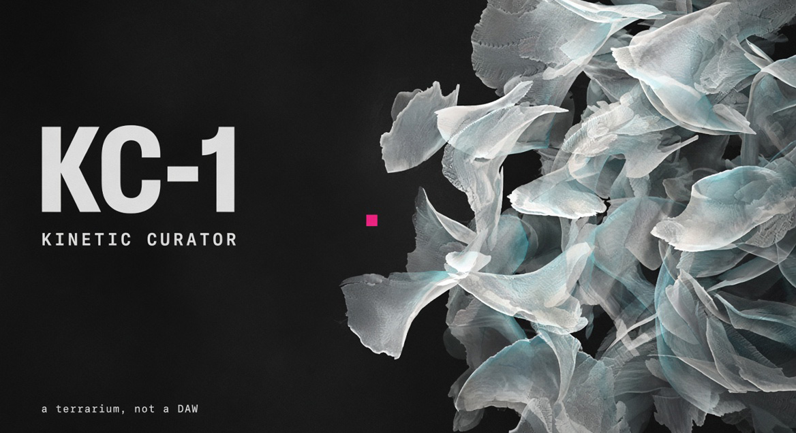

# Kinetic Curator

**KC-1** — a generative art instrument for live visual performance. React + Vite + one WebGL2 pipeline. What plays is what renders.

Live: [neuralio444.github.io/Kinetic_Curator](https://neuralio444.github.io/Kinetic_Curator/)



*A terrarium, not a DAW.* You curate plates, palettes, and voices. The seed and the wind do the rest.

**Release on `main` (2026-10-01):** **[0.9.0](CHANGELOG.md)** + the KC-1 review queue and what followed: pipeline SETUP/STAGE (authored canvas size), kinemes, the CHIAROSCURO sun, assignable audio routes, the Director panel, per-node uniqueness. Engine spines A–G merged, governor R1–R4 landed, Night Migration 30/60 sign-off recorded ([docs/EMBARGO.md](docs/EMBARGO.md) — Stage 1 unfrozen). Roadmap: [docs/ROADMAP_V1.md](docs/ROADMAP_V1.md). See [Now](#now-on-main).

## Now on main

The picture has mass and the flock keeps its own clock (dt loop, heading spring, shared wind). What plays is what renders, at one readout.

**Connected and live**

- One WebGL2 loop for canvas and stills (`app/src/gl/liveLoop.mjs`); SVG emitter is a dev-only parity reference.
- Kernel v1 — index-stable placements, channel RNG, sampler registry, K3–K5. SoA swarm with reference-parity goldens.
- Engine spines A–G: dt clock, atlas-cell skip, heading spring + ballistics + life, live mask tint, mode-chip dissolve + slider springs, shared noise + curl wind, bufferSubData.
- PATCH on the track: OFF / MOD / FIELD / FEED with per-mode strength sliders, stable-id targets, and an inline live readout under each patched row (#506 / #507).
- Math matrix, phases 1–2: MOD steering (source motion retunes target weights) and one shared scent field across layers (#509).
- Voice + preset MIX (stepped color, smooth palette, no rebake) with morph-ease arrival; flagship voices + curated road (motion factors #515–#519 filed).
- Flagship voices, 4 content-track cap, track patch round-trip + cap on load, H/M/L asset locker, FADE on the palette bar.
- ACCUM trails, GPU FX (chain compiler + template effects + cost tiers + measured costs), showrunner shed ladder behind one tape readout (budget knob, named stages, FX-stack weight).
- Behave profiles + bio-drives (drives, scent, mold, graze, leak, swell) on one integrator. Seven verbs: cruise, flock, orbit, scatter, mold, levy, lorenz. Audio ballistics shape mic input and the GL loop.
- **DIRECTORS panel** (#1126; formerly DAVIS, #830) — LOIS (NOD / VIBE / BURN / AWAY) vs Davis (FLOW / SEEDLING / UGLY / STUCK / BLOOM), both reading the honest feed; the panel hosts the argument. VOICES / GENERATE / PERFORM live here (flagship voices load-only, ✎ fork dish into MY VOICES), Evolve with live progress, phrase clock readout, ACCUM gestures.
- **PATTERN tracks** (#1039–#1042) — FIELD / QUILT / GLYPH modes in BUILD (add / edit / shuffle), with per-mode DRIFT, DROP gate, bar-quantized shuffle, and per-element kinemes; KIN and CURATOR rolls deal element motion too.
- **Slider dialogs** (#1127) — tap a slider's name for range expansion and mode switch; ROTATE defaults to continuous SPIN in rev/s, every mark with its own speed and direction.
- **Keep recall + recipes** (#996) — clicking a keep brings its tracks back (recall + morph, one undo); K keeps without starring; share links, recipe text and keeps carry the whole layer stack.
- **Web MIDI** (#617) — engine merged, mappings saved in the project; learn/bind remainder open, BLE-MIDI path needed for iPad.
- **Palette lab** (#953) — generate / edit / save / import / export; 37 palettes on the KIN strip.
- **WET engine** (#970) — standalone wetness service (WETNESS slider, vortex-particle core); ACCUM is one consumer.
- **MATH track** (#1010) — 12 tone ops on the FX fold, assignable macro knobs (#724).
- **Top bar** (#1103) — cold open, CUR and BEAT beside it; BEAT is the BPM master clock.
- **Pipeline SETUP + STAGE** (#606–#608) — canvas presets (VJ and social sizes), W×H lock/swap, capture fps. The live raster *and* the scene follow the authored size: a new aspect reveals more or less canvas, it never stretches the content. Stage: preview / fullscreen (Tauri stage window when native) / Syphon (honest not-linked status for now).
- **Audio as data** (#790, #613, #615, #618) — METER with seven named bands, an editable modulation MATRIX (band → target → depth, up to 16 routes, saved with the project, undoable), FEEL presets (Gentle / Punchy / Violent), and a FILE source with a `kc-audio-envelope/1` sidecar for deterministic reactivity.
- **CHIAROSCURO sun** (#594) — one scene-level light with per-instance diffuse, bevel-from-alpha normals, and squash-and-stretch (SQUASH) so moving marks keep their mass. DARK GLASS voice (#704). Gate weave (#741), FXAA (#740), ACES + Bayer resolve (#532).
- **Kinemes** (#781) — whole-mark motion (spin / rock / pulse / blink / bob) assigned per asset, evaluated in the vertex shader; no asset or atlas changes.
- **Per-node uniqueness** (#558) — no two nodes in lockstep: seeded per-agent phase, drift/speed multipliers and noise seed; legacy seeds stay bit-identical. Diorama parallax on zTiers (#796).
- **Taste curator** (#762) — import a Studio `taste.json`; CURATE picks with its head; `validate-taste.mjs` checks the file honestly.
- **Samplers and verbs** — truchet, voronoi-masked scatter, l-system growth, phyllotaxis; seek/flee behave rows; Markov transition weights; euclidean phrase clock.
- **Shell** — Curator cluster (LOOKS / VOICE / Curator) lives in the top bar; 4-state shape intensity mixer (#733); FADE is now a real per-node colour transition (#632); taxonomy LOOK / VOICE / SYSTEM / CAST ([docs/TAXONOMY.md](docs/TAXONOMY.md)).
- **Color modes** — FADE (the default melt), WASH (soak from the middle outward), INJECT (field dyes first, agents catch up). One slider, seconds.
- **Asset Studio** — merge assets with chamfer + live blend preview.
- **Living boot** — First Light starters: the instrument wakes up playing.
- **Halo** — soft wide bloom + vignette tuned for dark grounds.
- **Phyllotaxis sampler** — fibonacci's sibling; the DIVERGENCE slider re-counts the spiral arms.
- **Joiner/leaver** — obvious face / invisible face pairing.
- **DEV panel** — Shader Lab + X-Ray + Gov Tune in one place.

**Not done (do not advertise as shipped)**

- Evolve seed-jitter glide, editable BEHAVE weights (#471 / #479).
- Syphon / NDI output (STAGE shows an honest not-linked state), colour space waits on #532 ACES.
- Per-asset sub-animation frame strips (#699 — reverted; kinemes are the path).
- OSC build, MIDI learn/bind remainder (#617; BLE-MIDI path needed for iPad), mobile pass, live-output path (roadmap Stages 2–3).
- Matt-only: icons (#346), M3 calibration (#298), iPhone pass (#270).

**Embargo:** lifted 2026-09-23 (Night Migration sign-off). Stage 1 unfrozen; deferred pile still waits. Plan: [docs/EMBARGO.md](docs/EMBARGO.md). Agents: [AGENTS.md](AGENTS.md) + [docs/ROADMAP_V1.md](docs/ROADMAP_V1.md).

## Philosophy

Not a blank canvas. You assign palettes and instruct placement DNA. *We are not painting; we are breeding variations in a terrarium.* Ghost Station (`E` Evolve) mutates; you snapshot (`S`) and favorite (`F`).

## Reproducibility

**Full project JSON** (OUTPUT → ↓ PROJECT) is the unit: seed, palette, layout, assets, weights, quality, layers.

- Index `i` keeps scale / rotation / alpha / asset / color when count changes.
- RNG channels: `dens` / `geo` / `attr` / `asset` / `color` / `noise` / `dyn`.
- `createNoise(seed)` — no global perm table.
- Golden fixture: **`kernel.v1`**. 0.8 seeds will not match pixel-for-pixel.
- Audio, LFO life, Evolve are **live-only**. Still hashes ignore them.
- RENDER FINAL matches the live preview (UNCAPPED off). ACCUM stills export the trail buffer.

## Features

- **Live instrument** — Fibonacci, Phyllotaxis, Grid, CA, Orbit, Flow, Swarm, Stratified, … same GPU as exports.
- **Stills** — GPU readback 1×–8K PNG + JSON sidecar; default size follows the SETUP canvas.
- **Parity** — `npm run selfcheck`; under 10% pixel vs the SVG reference is a pass.
- **FX** — rgbSplit, displace, tear, grain, scanlines, posterize, invert, solarize, edge (+ template effects, no runner change per effect). Chain compiler + cost tiers + measured costs.
- **ACCUM** — phosphor trails, bloom / halation / stipple. FREEZE / CLEAR. Silence is a no-op.
- **Governor** — one tape readout (budget knob, named shed stages, FX-stack weight). The ladder sheds pixels before visible things, FX never culled.
- **Tracks** — KC-1…KC-4 + FX slots (tap-to-arm ghosts); patch links with live readouts; stable-id targets.
- **Audio** — mic or file (live FFT or a pre-analysed sidecar) → editable route matrix: scale, opacity, evolve-on-beat, ballistics-shaped envelopes.
- **Director** — Evolve, morph, phrase clock, LFO life, BEHAVE readout, voices.
- **Hits** — 1–9 recall, Enter advances.
- **Colour** — slot edit / locks, library, harmony + shuffle, FADE / WASH / INJECT.
- **Organisms** — moth / petal bodies, flap, breath, named behave profiles, bio-drives (hunger, scent, mold, graze, leak).
- **Assets** — drop SVG, tags, H/M/L, DUP. Asset Studio: merge with chamfer + live blend preview. Lab / species editor is deferred.
- **Studio farm** — `studio/studio.py` stills, ACCUM, batch, ffmpeg video, gated Curator CLIP.

## Stack

React 19 · Vite 8 · Zustand + `useApp` · `engine/kernel/*` · `app/src/gl/*` · CSS variables · Playwright + `selfcheck`.

## Install

```bash
git clone https://github.com/NeuralIO444/Kinetic_Curator.git
cd Kinetic_Curator/app
npm install
npm run dev
```

http://localhost:5173/Kinetic_Curator/

| Command | Purpose |
|---------|---------|
| `npm run dev` | Vite |
| `npm run build` | Production |
| `npm run lint` | ESLint |
| `npm run selfcheck` | Golden hash + kernel / GL / governor |
| `npm run test:e2e` | Playwright |
| `npm run preflight` | lint → selfcheck → build → e2e |

```bash
python3 studio/studio.py render my.project.json -o out.png --res 7680x4320 --sidecar
python3 studio/studio.py render my.project.json -o trails.png --accum --steps 24
python3 studio/studio.py batch my.project.json -o editions/ --count 500 --start-seed 0 --res 2
python3 studio/studio.py video my.project.json -o out.mp4 --fps 30 --duration 4 --res 1920x1080
```

Needs `ffmpeg` for video and `cd app && npx playwright install chromium` for GPU farm paths.

## Deploy

Pages is already on **GitHub Actions** → [live site](https://neuralio444.github.io/Kinetic_Curator/). Vercel: `vercel.json` builds `app/` with `VITE_BASE=/`. Netlify: `cd app && npm ci && VITE_BASE=/ npm run build` → `app/dist`.

## Docs

- [Engine plan](docs/archive/ENGINE_PLAN.md) — spine A–G, do not redo shipped MIX/MOD
- [Embargo](docs/EMBARGO.md) · [Two planes](docs/TWO_PLANES.md) · [Tempo](docs/TEMPO_AND_CHIPS.md)
- [GL contract](docs/GL_CONTRACT.md) · [ACCUM](docs/ACCUM.md) · [Showrunner](docs/SHOWRUNNER.md)
- [Organic motion](docs/ORGANIC_MOTION.md) · [Noise](docs/NOISE_AND_LAYERS.md) · [Tracks](docs/KC1_LAYERS.md)
- [Manifesto](docs/MANIFESTO.md) · [Changelog](CHANGELOG.md) · [Buglist](docs/BUGLIST.md)

## Hotkeys

`Space` pause · `S` snap · `F` favorite · `E` Evolve · `N` new seed · `G` fullscreen · `Cmd+Z` undo · `?` overlay · `1–9` hits · `Enter` advance setlist

## License

MIT. See `LICENSE`.
