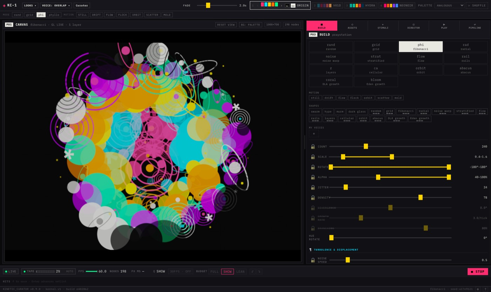

# UX/UI audit — shell + BUILD panel

**Date:** 2026-10-03 · **Audited commit:** `e402862` (main) · **Viewport:** 1680×1000, factory boot (`?boot=factory`)

Method: screenshots of the running build plus DOM measurements — computed styles,
WCAG contrast ratios, geometry, scroll extents — cross-checked against source. Every
number below is measured, not estimated; file/line references point at the rule that
produces it.

Screenshots: [`docs/review/ux-audit-2026-10-03/`](review/ux-audit-2026-10-03/)

---

## 1. Headline numbers

| Thing | Measured |
|---|---|
| Text ≤9.6px | **168 elements**; **31 of 164 below WCAG AA (4.5:1)**, 26 below 3:1 |
| Worst contrast | disabled slider labels **1.66:1** · `HITS` hint **1.61:1** · palette key numbers **2.16:1** · `MODE`/`MOTION` labels **2.58:1** · 6px `INK` label **1.15:1** |
| Slider rows | row 33px, pitch **35px**; grid `62px / 1fr / 120px` → right-aligned values leave ~100px dead gap |
| Thumb size | **14×18px** (`controls.css:27,41`); single-value sliders have **no track-fill rule at all** |
| Disabled rows | **13 of 27** struck through on first boot; `opacity .38` + `line-through` (`controls.css:17–19`) |
| Panel clipping | `.panel-body` 770px visible / 1707px content → **937px (55%) below the fold**, overlay scrollbar ≈0px, no fade anywhere in CSS |
| Canvas | buffer attr 1000×700 in a 1014×790 box, `object-fit: contain` (`canvas.css:32`) → **40px black bands top and bottom** (verified with an A/B `contain` vs `fill` render) |
| Hit targets | shape/mode chips **17–22px**, palette chips 21px (WCAG 2.5.8 wants 24px); tabs 34px, tiles 37px |
| Section rhythm | 35px between rows, **77–83px between sections** — uneven |

---

## 2. Findings

### 2.1 Hierarchy and redundancy — confirmed, but sharper than "same choice three times"

The mode axis genuinely appears three times:

1. **Top strip** — `MODE_FAVORITES = LAYOUT_MODES.slice(0, 4)`, glyph only (`ModeStrip.jsx:15`)
2. **BUILD tiles** — full 14 (`ModeGrid.jsx`)
3. **SHAPES chips** — a *different* axis (asset pool, #555), but `SHAPE_SETS` is built from
   `STUB_VOICES` whose names **mirror the mode list** (`voices.js:404–405`)

The failure is a **name collision, not literal duplication**: layout `flow` ≠ motion `flow`
≠ shape `flow`, all visible at once. Fix by distinguishing vocabulary/visual treatment per
axis — not by merging lists.

- **Sublabel repeats:** tiles where `glyph === name` — `grid/grid`, `flow/flow`, `orbit/orbit`,
  `abacus/abacus`, plus `rad/radial` near-repeat (`layout-modes.js:9–368`). Render the second
  line only when it adds information (`phi → fibonacci`, `coral → DLA growth`).
- **Panel IDs jump:** `P01 → P03` because P02 (ASSETS) is a drawer (`AssetPoolPanel.jsx:101`),
  and `P08` (LAYERS) nests inside BUILD (`LayerStack.jsx:169`). A user sees 1, 3, 8 with no way
  to navigate them. Show all eight or drop the tags.
- **`MY VOICES`** renders a label plus a lone `+` with only a hover tooltip — add a one-line
  empty-state hint ("capture the current state as a voice").

### 2.2 One accent, one meaning — confirmed, and there are five signal colors

| Signal | Where |
|---|---|
| Pink `#ff2d6f` | active tab (`ux-polish.css:33`), STOP, active budget tier |
| Yellow `#ffd400` | slider thumbs + fills (`controls.css:27,34`) |
| Cyan `#00d9ff` | section subheaders (`controls.css:12`), dirty palette, **and** `--focus` (`tokens.css:27`) |
| Green `#00ff88` | LIVE dot, FPS fill — hardcoded (`layout.css:196,203`, `MasterBar.jsx:92`) |
| White `--ink` fill | selected mode tile (`panels.css:90`), selected chip (`panels.css:35`) |

Worse, **"selected" has four encodings**: solid pink tab, white-filled tile, white-filled chip,
bordered strip chip. Proposed roles:

- **Pink** = selected/active only · **Yellow** = editable values · **Green** = system health ·
  **Cyan** = keyboard focus only (it is already `--focus`)
- Selected tile/chip → **pink 1px border + lifted background** instead of the white fill (the
  only light surface in the UI pulls the eye off the canvas)
- Active tab → **2px pink underline + brighter label**, not a solid block

### 2.3 Sliders

- **No fill on single-value sliders** — only `.dual-fill` exists (`controls.css:34`). Add a
  start-to-thumb fill so COUNT/JITTER/DENSITY match SCALE/ROTATE/ALPHA.
- **Value gap is structural:** `grid-template-columns: 62px 1fr 120px` (`controls.css:16`) with
  right-aligned readouts — the number can sit ~100px from the track end. Shrink the readout
  column to fit content (~60px) or move it next to the track.
- **Wrapping labels:** `GROWTH RATE`, `HUE ROTATE`, `NOISE SPEED` wrap because the label column
  is a fixed 62px at 9px + 0.1em tracking. Fix the column to the longest label; don't wrap.
- **Disabled rows:** `opacity .38` + `line-through` (`controls.css:17–19`) puts the labels at
  **1.66:1**, and yellow thumbs × .38 render olive (reads "dirty", not "off"). Remove the
  strikethrough, use ~.6 opacity, keep the dim thumb but make it neutral grey.
- **Thumbs** are 14×18px — larger than the 9px label they belong to. ~6×14 reads as a precise
  handle (their suggestion holds); at minimum keep a single thumb size across single/dual.
- **Lock buttons** are a 13px glyph in a 26–33px box at `.7` opacity (`controls.css:50–55`) vs
  9px labels — dim to ~.3, brighten on hover/locked, faint tint on the locked row.

### 2.4 Type and contrast — the biggest measurable defect

- Section labels are **8px, not 9px**: `.mode-strip-label` 8px `--dimmer` (`layout.css:145` →
  **2.58:1**), `.shelf-label` 8px (`panels.css:128`), `.panel-tab-label` 8px (`ux-polish.css:39`),
  `.range-label` 9px (`controls.css:17`), canvas corners 8px (`canvas.css:34`).
- **31 of 164** small labels fail AA; worst 26 are below 3:1 (disabled rows, HITS hint,
  palette key numerals — the latter *deliberately* quiet per the #357 comment at
  `layout.css:250`, but at 2.16:1 they are effectively invisible).
- **Casing is decided per component, not by a system:** `ModeStrip.jsx:50` calls
  `m.name.toUpperCase()` while `ModeGrid.jsx` renders the same `m.name` raw — that one line is
  why the strip says `STILL` and the panel says `still`. On top of that the stylesheets carry
  **8 uppercase and 6 lowercase `text-transform` rules**, plus title-case `Curator` beside
  `LOOKS`/`VOICE` and `KINETIC_CURATOR` in the footer. Pick one rule (uppercase for sections
  and controls, lowercase for values/modes) and delete the rest.
- **The `≡≡≡` marks under SHAPES chips are `.shape-pips`** — 6×3px LED pips on 14 chips
  (`panels.css:41–43`). A `title` tooltip exists (#733) but only on hover; add a legend or make
  the pip state readable at a glance.

### 2.5 Spacing rhythm

- 35px row pitch vs **77–83px section gaps** — pick an 8px-based scale (24 between sections,
  8 label→content, 4 between chips). `.param-block` already has padding + border-top to hang it on.
- Slider rows feel loose next to the dense chips; ~28px pitch tightens the panel and buys back
  some of the 937 hidden pixels.
- **No bottom cue:** `.panel-body { overflow-y: auto }` (`panels.css:24`) with a ~0px overlay
  scrollbar and no fade/mask in any stylesheet. Add a 24px bottom fade + a visible scroll
  affordance (or a "N more rows" hint).

### 2.6 Canvas framing — letterbox confirmed, details corrected

- Mechanism is real: fixed 1000×700 buffer (`useCanvasViewport.js:5–6`) drawn into a
  free-filling box with `object-fit: contain` (`canvas.css:32`).
- **Measured:** A/B render test (`contain` vs `fill`) — content occupies rows **40–749** of a
  790px box → **40px black bands top and bottom** at 1680×1000; bands vanish at 2560×1300
  (box ratio ≈ 10:7); *side* bars only appear on wide-short windows.
- Corner badges (`0,0` / mode / `ORIGIN` / `1000 × 700`) are anchored to `.canvas-wrap`
  (`CanvasPanel.jsx:202–205`), so they float **in the bar**, not on the image corners.
- Two size readouts can disagree: header pill uses live/export size (`CanvasPanel.jsx:177`),
  the corner badge uses constants (`CanvasPanel.jsx:205`).
- Fix: `aspect-ratio: 10/7` on `.canvas-wrap` (no bars), or letterbox deliberately with badges
  pinned to the image edge. `RESET VIEW` / `BG: PALETTE` can drop to lower contrast until hover.

### 2.7 Header and status bar

- **`SHOW` appears twice:** `.meter-value` "SHOW" (`MasterBar.jsx:143`) and the active budget
  tier button (`BudgetKnob.jsx`). Cleanest fix: **delete the Q meter readout** — the pink
  budget button already shows current state — or rename the tiers (they are deliberately
  FULL/SHOW/LEAN, `BudgetKnob.jsx:4`).
- **Clusters:** the DOM already has `.master-left` / `.master-right` / `.undo-group` — add
  dividers: transport (LIVE, TAPE) · performance (FPS, NODES, FX) · output (Q, budget, STOP).
- **The hint line is labelled `HITS`, not `HINTS`** (`FavoritesTray.jsx:85`) and sits at
  **1.6:1** — merge it into the status bar as lighter-grey keyboard hints or raise its contrast.
- **Palette presets:** inactive chips are already at `--dim` (50%, `layout.css:241`) — that part
  is fine. What fails: the 9px key numerals at 2.16:1 and the swatch colors themselves not
  dimming with the chip.

---

## 3. What a prior review pass got right, wrong, and missed

**Right:** accent roles, slider polish, and contrast as the top three priorities; sublabel
repeats; the P01→P03 gap; strikethrough on disabled rows; value gap; casing incoherence; no
bottom cue; duplicate `SHOW`.

**Wrong / imprecise:**

- The hint line reads **`HITS`**, not `HINTS`.
- Inactive palette chips are **already** ~50% dim; the numerals are quiet on purpose (#357).
- SHAPES chips are **not** a third copy of the modes — they swap the asset pool (#555) — but
  the mirrored naming makes them read that way.
- The letterbox is real but at 1680×1000 the bands are **top/bottom (40px)**, not side bars.
- Labels are mostly **8px**, not 9px.

**Missed:** 13/27 sliders struck through at boot; 937px of hidden panel with no affordance;
17–22px chip hit targets; letterbox measured; duplicate canvas size readouts; `MY VOICES`
empty state; four different encodings of "selected".

**Worth keeping:** `role=tablist`/`aria-selected` with arrow-key nav, tooltips on most
controls, pips using fill+outline rather than opacity alone, disabled state never conveyed
by color alone.

---

## 4. Ranked quick wins (impact / effort, no behavior changes)

| # | Change | Where |
|---|---|---|
| 1 | Disabled rows: drop `line-through`, `.38` → ~.6 opacity | `controls.css:17–19` |
| 2 | Labels 8–9px → 10–11px; `--dimmer` → `--dim` for section/strip labels | `layout.css:145`, `panels.css:128`, `controls.css:17`, `ux-polish.css:39` |
| 3 | Accent roles: white-fill selection → pink outline; active tab → underline; cyan = focus only | `panels.css:35,90`, `ux-polish.css:33`, `tokens.css:27` |
| 4 | Value column 120px → ~60px so numbers sit against the tracks | `controls.css:16` |
| 5 | Fill single-slider tracks start→thumb | `controls.css:38–44` |
| 6 | Panel bottom fade + scroll affordance (937px hidden) | `panels.css:24` |
| 7 | Canvas `aspect-ratio: 10/7`; badges on image edge; one size source of truth | `canvas.css:9,32`, `CanvasPanel.jsx:177,202–205` |
| 8 | One `SHOW`: drop the Q meter or rename budget tiers | `MasterBar.jsx:143`, `BudgetKnob.jsx` |
| 9 | Casing system: remove the `.toUpperCase()`, fix `Curator`, delete conflicting transforms | `ModeStrip.jsx:50`, 14 `text-transform` rules |
| 10 | Tile sublabel only when glyph ≠ name | `ModeGrid.jsx` tiles |
| 11 | Chips ≥24px hit area | `panels.css:26` |
| 12 | `MY VOICES` empty hint; absorb/raise the `HITS` line | `ModeGrid.jsx`, `FavoritesTray.jsx:84–86` |

---

## 5. Verification notes

- Factory boot, `?boot=factory`, first-run overlay dismissed, built from `e402862`.
- Contrast: WCAG 2.1 relative luminance, alpha composited against the effective background,
  ancestor `opacity` folded in; 4 corner labels over the canvas excluded (unknowable).
- Canvas letterbox: element screenshots under `object-fit: contain` vs `fill`, pixel-scanned
  for the artwork bounding box (rows 40–749 vs 0–789).
- Re-run scripts live in the reviewer's checkout (`app/audit*.mjs`), not committed.
