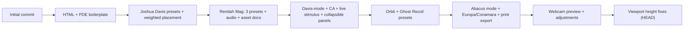

# Kinetic Curator — Repository Review

> **Version assessed:** v0.4.1 · `main` branch @ `0f6dff1`
> **12 commits**, single branch, clean working tree.

---

## 1 · Project Overview

Kinetic Curator is a **generative art engine** inspired by Joshua Davis / HYPE framework, with Rendah Mag aesthetic integration. It ships as two independent runtimes:

| Runtime | Stack | Status |
|---------|-------|--------|
| **Processing sketch** (`KineticCuratorSketch/`) | Processing 4 / Java, HYPE library, P3D | Functional scaffold — basic layout only |
| **Browser UI** (`KineticCuratorUI/`) | React 18 via CDN + Babel in-browser transpile | Feature-rich prototype, most development lives here |

The browser UI is the clear focus — **~170 KB of JSX/JS** comprising 7 panels, 13 composition presets, 11 layout modes, live webcam + audio stimulus, a Davis-mode evolve/curate workflow, snapshot/sidecar export, and a 50+ inline SVG asset library across 7 categories.

---

## 2 · Architecture Assessment

### What's working well

- **Clean panel decomposition.** Each concern (canvas, pool, controls, router, stimulus, davis-mode, output) is its own file/component. State lifts cleanly through `App`.
- **Deterministic rendering.** xorshift32 PRNG + seed means every frame is reproducible from `seed + config`. The sidecar JSON captures the full state for re-rolling.
- **Thoughtful preset system.** 13 presets with per-preset category weighting, palette shift strategy, and tuned parameter blocks. Presets are data-driven — adding new ones is just an array entry.
- **Stimulus pipeline.** Webcam motion + Web Audio beat detection both feed a unified `motionEnergy` / `beatPulse` that the canvas consumes. Good separation between source (webcam-input, audio-input) and consumer (ui-canvas).
- **CA engine.** The cellular automaton with bitwise color mutation is a genuinely interesting compositional tool.

### Structural concerns

| Area | Issue |
|------|-------|
| **No build system** | Babel transpiles JSX in-browser at runtime. Works for prototyping but adds ~300 KB of parser to every page load and blocks rendering. |
| **Global window namespace** | All components are mounted on `window` (e.g. `window.CanvasPreview = CanvasPreview`). Script load order in the HTML is fragile — reorder and it breaks. |
| **Duplicated COMPOSITION_PRESETS** | Presets are defined identically in both `ui-canvas.jsx` and `ui-controls.jsx`. A single source of truth would prevent drift. |
| **Hook aliasing** | Every file re-destructures React hooks with unique names (`useStateApp`, `useStateLM`, `useStateAP`, `useEffectCV`, etc.) to avoid collisions. This is a workaround for the lack of module scope. |
| **Processing ↔ Browser parity gap** | The Processing sketch has only a basic grid layout. The browser UI has 11 modes, 13 presets, CA, orbit, abacus, etc. These are entirely separate codebases with no shared logic. |

---

## 3 · Development Status

### Feature completion matrix

| Feature | Status | Notes |
|---------|--------|-------|
| SVG asset library (7 core categories) | ✅ Complete | 50+ inline SVG assets with metadata |
| Experimental categories (crystalline, bio, fragments, scan) | ⚠️ Stub | Referenced by presets but no actual assets — falls through to full pool |
| 13 composition presets | ✅ Complete | Data-driven, well-tuned |
| 11 layout modes | ✅ Complete | random → abacus, all functional |
| Live webcam stimulus | ✅ Complete | Motion detection + brightness/contrast/blur adjustments |
| Live audio stimulus | ✅ Complete | FFT, per-band RMS, bass-spike beat detection |
| Davis-mode (evolve/fav/slow) | ✅ Complete | Time + beat-driven seed evolution |
| PNG export at resolution | ✅ Complete | SVG → Canvas rasterization with sidecar JSON |
| PDF export | ⚠️ Stub | Emits JSON only — no actual PDF rendering |
| OSC bridge | ❌ Not started | Footer mentions `localhost:9001`, no implementation |
| Config import / re-roll from JSON | ❌ Not started | Export works, import doesn't exist |
| User SVG upload | ❌ Not started | `uploads/` dir exists with a pasted PNG, no upload UI |
| Processing runtime parity | ⚠️ Minimal | Basic grid layout only |
| Responsive / mobile layout | ❌ Not started | Fixed 3-column grid, `overflow: hidden` on body |
| Palette editing | ❌ Not started | Only palette switching via 5 hard-coded palettes |
| Undo / history | ❌ Not started | |

---

## 4 · Code Quality Findings

### Bugs

| # | Severity | File | Issue |
|---|----------|------|-------|
| B1 | 🔴 High | [audio-input.jsx](file:///Users/mattciaglia/Documents/GitHub/Kinetic_Curator/KineticCuratorUI/audio-input.jsx#L88) | `analyzeAudio` is called inside `initAudio()` but defined as a sibling function, not a closure member. It captures `analyserRef` via ref which works, but the function uses `requestAnimationFrame(analyzeAudio)` recursively without checking `runningRef` at the *scheduling* point — if the cleanup runs between schedule and execution, it can fire one extra frame after teardown. |
| B2 | 🟡 Medium | [AudioRouter.pde](file:///Users/mattciaglia/Documents/GitHub/Kinetic_Curator/KineticCuratorSketch/AudioRouter.pde#L4) | `AudioRouter.pde` has `import ddf.minim.*` at the top level, but the main sketch comments it out. Processing will fail to compile if `AudioRouter.pde` is included without Minim installed, even when `enableAudio = false`. |
| B3 | 🟡 Medium | [AudioRouter.pde](file:///Users/mattciaglia/Documents/GitHub/Kinetic_Curator/KineticCuratorSketch/AudioRouter.pde#L96-L101) | `switchToMicrophone()` re-opens `getLineIn()` — should be `minim.getInput()` for actual mic input. Current code just re-initializes the same line-in. |
| B4 | 🟡 Medium | [app.jsx](file:///Users/mattciaglia/Documents/GitHub/Kinetic_Curator/KineticCuratorUI/app.jsx#L463-L474) | Hotkey effect (`useEffectApp`) has no dependency array closure over `addSnapshot` and `favoriteCurrent`. These are re-created every render, so the effect registers a stale handler. The `s` key will always snapshot with the *initial* state. Should wrap those functions in `useCallback` or use refs. |
| B5 | 🟢 Low | [ui-canvas.jsx](file:///Users/mattciaglia/Documents/GitHub/Kinetic_Curator/KineticCuratorUI/ui-canvas.jsx#L441) | `dangerouslySetInnerHTML` inside a `<g>` with `key` — if an asset's SVG contains malformed markup, it can break the entire canvas render tree silently. |
| B6 | 🟢 Low | [ui-shell.jsx](file:///Users/mattciaglia/Documents/GitHub/Kinetic_Curator/KineticCuratorUI/ui-shell.jsx#L14) | `downloadSVG` builds the SVG string twice — once with CSS vars, once inlined. The first build (`svg`) is never used. Dead code. |
| B7 | 🟢 Low | [assets.js](file:///Users/mattciaglia/Documents/GitHub/Kinetic_Curator/KineticCuratorUI/assets.js#L7) | `ASSET_CATEGORIES` only lists the 7 core categories. The 4 experimental categories (`crystalline`, `biosynthetic`, `fragments`, `scanlines`) documented in `ASSET_CATEGORIES.md` are missing from this array, so the pool's filter chips won't show them even if assets are added. |

### Code smells

| Area | Detail |
|------|--------|
| **Prop drilling depth** | `App` passes 20+ props to `StimulusPanel` and `DavisModePanel`. A context or reducer would clean this up. |
| **Magic numbers** | Beat threshold `50`, cooldown `10` frames, beat pulse `0.4` threshold, smoothing factor `0.95` — all hard-coded in both Processing and browser versions with no way to tune. |
| **No error boundaries** | A runtime error in any panel (e.g., bad SVG, audio context failure) takes down the entire app. |
| **Inline styles in AudioInput** | The `AudioInput` component uses inline `style={}` objects instead of CSS classes, inconsistent with the rest of the codebase. |
| **`density: 105` and `112`** | Some presets set density > 100 (Fujimoto Prism: 105, Halftime Glitch: 112) but the UI slider max is 100. These values can only be set via preset selection, not the slider. |

---

## 5 · Roadmap Suggestions

### 🔴 Priority 1 — Stability & Polish

| # | Task | Rationale |
|---|------|-----------|
| R1 | **Fix hotkey stale closure (B4)** | Users pressing `s` will get wrong seed in snapshot. Quick fix with `useCallback` + proper deps. |
| R2 | **Guard AudioRouter compilation (B2)** | Anyone opening the Processing sketch without Minim will get a compile error. Wrap in conditional or move to a separate tab with instructions. |
| R3 | **Add error boundary around canvas** | One bad SVG shouldn't white-screen the app. Wrap `CanvasPreview` in a React error boundary. |
| R4 | **Single-source presets** | Extract `COMPOSITION_PRESETS` to a shared `presets.js` loaded before both `ui-canvas.jsx` and `ui-controls.jsx`. |

### 🟡 Priority 2 — Feature Completion

| # | Task | Rationale |
|---|------|-----------|
| R5 | **Config import (re-roll from JSON)** | Sidecar export is already implemented. Adding a "load config" button completes the loop — users can share seeds. |
| R6 | **User SVG upload** | The `uploads/` directory exists. Add a drag-and-drop zone to the Asset Pool panel that parses SVGs and adds them to `window.ASSETS`. |
| R7 | **Real PDF export** | Use a library like [jsPDF](https://github.com/parallax/jsPDF) with SVG-to-PDF, or at minimum embed the SVG in a PDF wrapper. Current "PDF" just emits JSON. |
| R8 | **Experimental category assets** | Author or source SVGs for `crystalline`, `biosynthetic`, `fragments`, `scanlines`. Without them, 4 of 13 presets don't get category-filtered picks. |
| R9 | **Density slider max → 120** | Presets already go above 100. Let the slider reflect the actual range. |

### 🟢 Priority 3 — Architecture & DX

| # | Task | Rationale |
|---|------|-----------|
| R10 | **Vite build** | Replace in-browser Babel with a proper build step. Eliminates ~300 KB parser, enables HMR, tree-shaking, and ES modules. |
| R11 | **State management** | Introduce `useReducer` or a lightweight context for the 30+ state variables in `App`. Reduces prop drilling and makes undo/redo feasible. |
| R12 | **OSC bridge** | Implement WebSocket server on `localhost:9001` that accepts OSC-over-WS messages, mapping to stimulus inputs. Enables TouchDesigner/Resolume integration. |
| R13 | **Responsive layout** | Add media queries for ≤1024px (2-column) and ≤768px (single-column stack). Panels already collapse — just need grid breakpoints. |
| R14 | **Processing runtime modernization** | Port the browser's layout modes and preset system to Processing. Consider a shared JSON preset format. |
| R15 | **Palette editor** | Allow creating/editing palettes in-app rather than hardcoding in `palettes.js`. Persist to localStorage. |

---

## 6 · File-by-file summary

| File | Lines | Role | Health |
|------|-------|------|--------|
| [KineticCurator.pde](file:///Users/mattciaglia/Documents/GitHub/Kinetic_Curator/KineticCuratorSketch/KineticCurator.pde) | 70 | Main Processing sketch | ✅ Clean |
| [AssetPool.pde](file:///Users/mattciaglia/Documents/GitHub/Kinetic_Curator/KineticCuratorSketch/AssetPool.pde) | 61 | SVG loader + placeholder | ✅ Clean |
| [InputRouter.pde](file:///Users/mattciaglia/Documents/GitHub/Kinetic_Curator/KineticCuratorSketch/InputRouter.pde) | 89 | Webcam + audio blend | ✅ Clean |
| [AudioRouter.pde](file:///Users/mattciaglia/Documents/GitHub/Kinetic_Curator/KineticCuratorSketch/AudioRouter.pde) | 113 | FFT + beat detection | ⚠️ B2, B3 |
| [LayoutManager.pde](file:///Users/mattciaglia/Documents/GitHub/Kinetic_Curator/KineticCuratorSketch/LayoutManager.pde) | 51 | Grid-only layout | ⚠️ Far behind browser |
| [KineticCurator.html](file:///Users/mattciaglia/Documents/GitHub/Kinetic_Curator/KineticCuratorUI/KineticCurator.html) | 40 | Entry point | ✅ Clean |
| [app.jsx](file:///Users/mattciaglia/Documents/GitHub/Kinetic_Curator/KineticCuratorUI/app.jsx) | 594 | Main app + state | ⚠️ B4, prop drilling |
| [ui-canvas.jsx](file:///Users/mattciaglia/Documents/GitHub/Kinetic_Curator/KineticCuratorUI/ui-canvas.jsx) | 455 | Canvas + all layout logic | ⚠️ B5, duplicated presets |
| [ui-controls.jsx](file:///Users/mattciaglia/Documents/GitHub/Kinetic_Curator/KineticCuratorUI/ui-controls.jsx) | 466 | Layout + router + output panels | ⚠️ Duplicated presets |
| [ui-pool.jsx](file:///Users/mattciaglia/Documents/GitHub/Kinetic_Curator/KineticCuratorUI/ui-pool.jsx) | 181 | Asset browsing | ✅ Clean |
| [ui-shell.jsx](file:///Users/mattciaglia/Documents/GitHub/Kinetic_Curator/KineticCuratorUI/ui-shell.jsx) | 140 | Master bar + utilities | ⚠️ B6 dead code |
| [audio-input.jsx](file:///Users/mattciaglia/Documents/GitHub/Kinetic_Curator/KineticCuratorUI/audio-input.jsx) | 162 | Web Audio mic input | ⚠️ B1 |
| [webcam-input.jsx](file:///Users/mattciaglia/Documents/GitHub/Kinetic_Curator/KineticCuratorUI/webcam-input.jsx) | 152 | getUserMedia motion | ✅ Clean |
| [ca-engine.jsx](file:///Users/mattciaglia/Documents/GitHub/Kinetic_Curator/KineticCuratorUI/ca-engine.jsx) | 172 | CA + bitwise transforms | ✅ Clean |
| [tweaks-panel.jsx](file:///Users/mattciaglia/Documents/GitHub/Kinetic_Curator/KineticCuratorUI/tweaks-panel.jsx) | 426 | Floating tweaks UI | ✅ Clean (reusable module) |
| [palettes.js](file:///Users/mattciaglia/Documents/GitHub/Kinetic_Curator/KineticCuratorUI/palettes.js) | 47 | 5 palettes | ✅ Clean |
| [assets.js](file:///Users/mattciaglia/Documents/GitHub/Kinetic_Curator/KineticCuratorUI/assets.js) | 8 | Asset combiner | ⚠️ B7 |
| [styles.css](file:///Users/mattciaglia/Documents/GitHub/Kinetic_Curator/KineticCuratorUI/styles.css) | 825 | Full UI stylesheet | ✅ Well-organized |

---

## 7 · Bottom line

This is a **strong creative-tool prototype** with genuine artistic depth — the preset system, seed-based reproducibility, and stimulus pipeline are well-designed. The main liabilities are architectural (no build system, global scope, duplicated data) rather than conceptual. The highest-impact next moves are:

1. **Fix the hotkey stale-closure bug** (users will notice wrong snapshots)
2. **Extract presets to a single file** (prevents silent drift)
3. **Add config import** (completes the seed-sharing workflow that's 90% done)
4. **Author experimental-category SVGs** (4 presets are visually indistinguishable from each other without them)

Let me know which direction you'd like to go first and I'll jump in.
